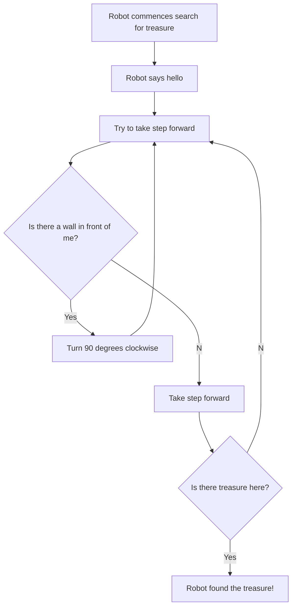

# Robot-Practice
# Evolutionary-Optimization
This toy package allows the user to deploy robots in search of a treasure.

## Introduction
This package roughly follows the 70053 python course by Josiah Wang at 
Imperial College London. 

This package places "robots" in a grid in search of a treasure.

## Using the Package
### Getting Started 
To get started with this package clone this repo:

```bash
git clone https://github.com/mwolinska/Robot-Treasure-Hunt
```
Then enter the correct directory on your machine:
```bash
cd Robot-Treasure-Hunt
```
This package uses [poetry](https://python-poetry.org) dependency manager. 
To install all dependencies run:

```bash
poetry install
```

### Using scripts
The robot logic is as follows:

A sample output of 2 loops for a robot named Ted is:
```bash 
Hello my name is Ted, my age is 3. My ID is 1
I am in position (0, 0), this is the top left quadrant. I am facing North.
Oh no, I hit a wall. I will turn 90 degrees.
I am in position (0, 0), this is the top left quadrant. I am facing East.
[[  0.   1.   0.   0.   0.   0.   0.   0.   0.   0.]
 [  0.   0.   0.   0.   0.   0.   0.   0.   0.   0.]
 [  0.   0.   0.   0.   0.   0.   0.   0.   0.   0.]
 [  0.   0.   0.   0.   0.   0.   0.   0.   0. 111.]
 [  0.   0.   0.   0.   0.   0.   0.   0.   0.   0.]
 [  0.   0.   0.   0.   0.   0.   0.   0.   0.   0.]
 [  0.   0.   0.   0.   0.   0.   0.   0.   0.   0.]
 [  0.   0.   0.   0.   0.   0.   0.   0.   0.   0.]
 [  0.   0.   0.   0.   0.   0.   0.   0.   0.   0.]
 [  0.   0.   0.   0.   0.   0.   0.   0.   0.   0.]]
I am in position (0, 1), this is the top left quadrant. I am facing East.
```

Three scripts come preloaded to the package:
* run_from_file: 
  * populate the robot_names.txt file with your desired robot names.
* run_from_user_input:
  * allows the user to populate a robot from the terminal interface
A sample output: 
```bash 
What is your robot's name?
Ted 
What is your robot's age?
3
Which row is your robot starting in?
0
Which column is your robot starting in?
0
```
* run_from_random
  * Three robots are randomly generated and aim for the same treasure.
